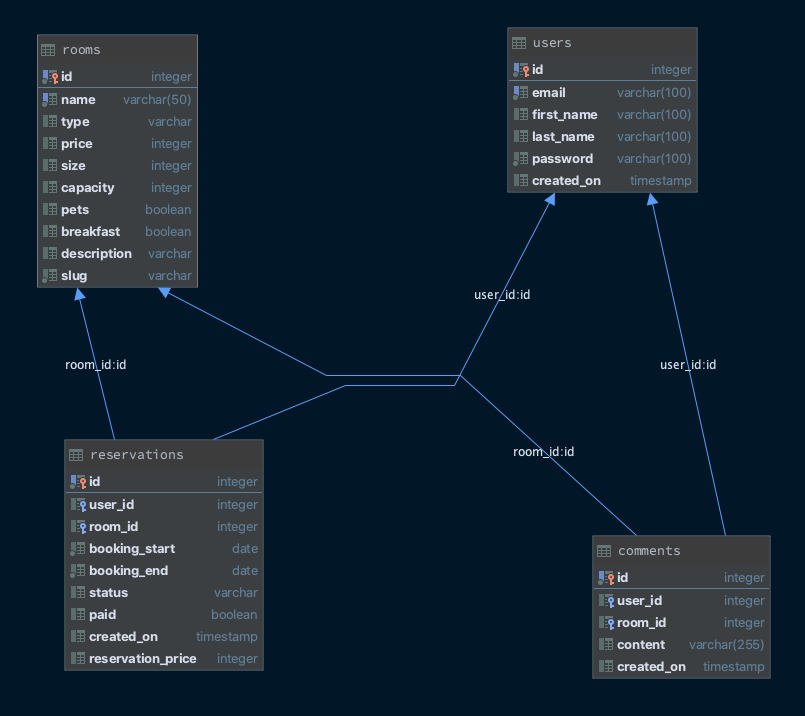

# Booking API

Booking API using Node, Express, and Postgres. The main goal of the project was to create a REST API for room reservations with the payment process. The first step was to create a custom user authentication process on my own without made-ready solutions. Next, I prepared a lot of other features. For example, you can create room objects with comments management. Of course, you can find a room with details or get a list of rooms. For the payment process, I configured the Stripe API and Payment Indent method. 

## Requirements

* Node 10
* Postgres 12.4

## Installation

First of all, you have to install each of the required packages.

```bash
yarn install
```

## How to run

Run migrations for setup database.

```node
yarn start create-dev-tables
```

Run server

```node
yarn start
```

## How to test

For test API you can use [Postman](https://www.postman.com/), just download collection from link bellow then import.
* [JSON collection](./docs/collection.json)

## Database schema


## License
[MIT](https://choosealicense.com/licenses/mit/)
